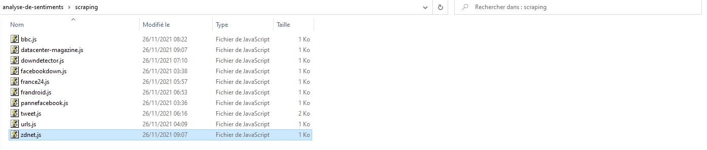

# analyse-de-sentiments

## Scraping web 
J'ai réalisé le webscraping en JavaScript, tous les scripts se trouvent dans le dossiers
**Scripting** et chaque fichier correspond à un site web en haut de chaque sur la première ligne se trouve l'URL du site.
Pour récupérer les informations d'une page:

